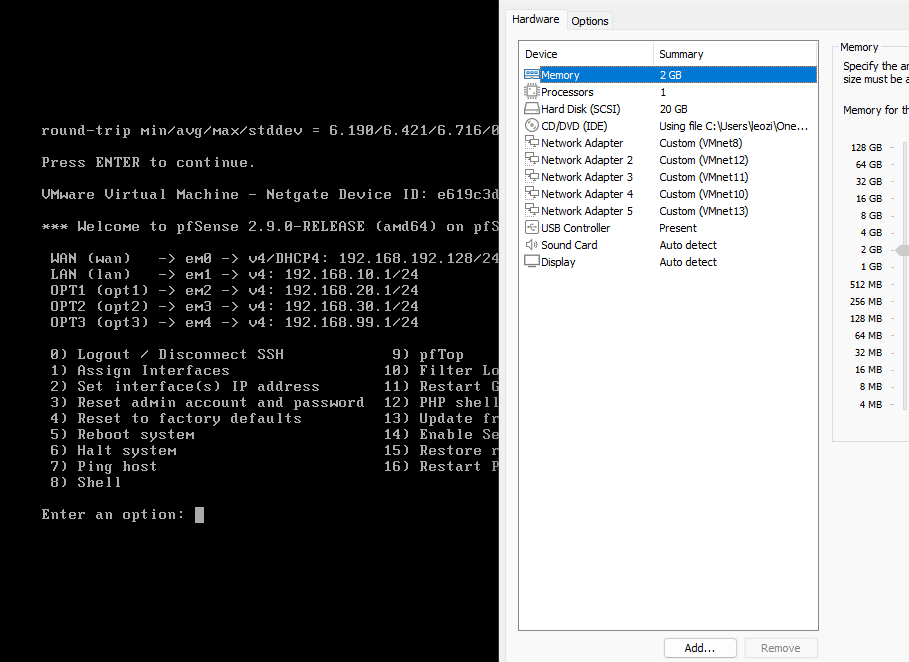

# 01 — Arquitetura

## Diagrama da rede

> Arquivo editável: `diagramas/diagrama-rede.drawio` (exporte o PNG sempre que alterar).

---

## Zonas e endereçamento

O firewall **pfSense (FW01)** fica no centro, com uma interface por zona. Cada zona é uma rede virtual isolada (VMnet) no VMware Workstation.

| Zona | Interface pfSense | VMnet | Sub-rede | Gateway |
|---|---|---|---|---|
| WAN | WAN (em0) | VMnet8 (NAT) | DHCP | — |
| Servidores | LAN (em1) | VMnet10 | 192.168.10.0/24 | 192.168.10.1 |
| Usuários | OPT1 (em2) | VMnet11 | 192.168.20.0/24 | 192.168.20.1 |
| Segurança | OPT2 (em3) | VMnet12 | 192.168.30.0/24 | 192.168.30.1 |
| Ataque | OPT3 (em4) | VMnet13 | 192.168.99.0/24 | 192.168.99.1 |

---

## Inventário de VMs

| # | Hostname | Sistema | vCPU | RAM | Disco | IP | Zona |
|---|---|---|---|---|---|---|---|
| 1 | FW01 | pfSense CE 2.9 | 1 | 1–2 GB | 20 GB | gateways .1 | todas |
| 2 | SRV-DC01 | Windows Server 2025 Eval | 2 | 4 GB | 60 GB | 192.168.10.10 | Servidores |
| 3 | SRV-FILE01 | Ubuntu Server 24.04 | 1 | 2 GB | 40 GB | 192.168.10.20 | Servidores |
| 4 | WS-RH01 | Windows 11 Enterprise Eval | 2 | 3 GB | 60 GB | DHCP (.100–.200) | Usuários |
| 5 | WS-FIN01 | Windows 11 Enterprise Eval | 2 | 3 GB | 60 GB | DHCP (.100–.200) | Usuários |
| 6 | SRV-SIEM | Wazuh (OVA) | 4 | 8 GB | 80 GB | 192.168.30.50 | Segurança |
| 7 | KALI01 | Kali Linux | 2 | 3 GB | 60 GB | 192.168.99.10 | Ataque |

Host: Ryzen 7 5700X3D · 32 GB RAM — comporta o ambiente quase todo ligado.

---

## Serviços de rede

- **DNS:** SRV-DC01 (`192.168.10.10`). O DC encaminha (forwarder) para o pfSense (`192.168.10.1`) para resolver a internet.
- **DHCP:** SRV-DC01 serve a zona de Usuários; o pfSense faz **DHCP Relay** da zona de Usuários para o DC.
- **Faixa DHCP de Usuários:** `192.168.20.100` a `192.168.20.200`.

---

## Política de firewall (menor privilégio)

| Origem | Destino | Permitido | Motivo |
|---|---|---|---|
| Usuários | SRV-DC01 | DNS, Kerberos, LDAP, SMB | Ingresso e uso do domínio |
| Usuários | SRV-FILE01 | SMB (445) | Compartilhamento de arquivos |
| Usuários | Internet | HTTP/HTTPS | Navegação |
| Todas | SRV-SIEM | 1514/1515 | Envio de logs do agente |
| Segurança | Todas | Tudo | Gestão |
| Ataque | Usuários/Servidores | **Só durante o teste** | Simulação controlada |
| Ataque | Internet | **BLOQUEADO SEMPRE** | Isolamento |
| Qualquer | Qualquer | **Negar o resto** | Default deny |

---

## Convenções de nomes

- Servidores: `SRV-FUNÇÃO` → `SRV-DC01`, `SRV-FILE01`, `SRV-SIEM`
- Estações: `WS-DEPTO01` → `WS-RH01`, `WS-FIN01`
- Usuários: `nome.sobrenome`
- Contas administrativas separadas: `adm.nome` (não usar no dia a dia)
- Contas de serviço: `svc.nome`

Veja também: [`decisoes-de-arquitetura.md`](decisoes-de-arquitetura.md).
